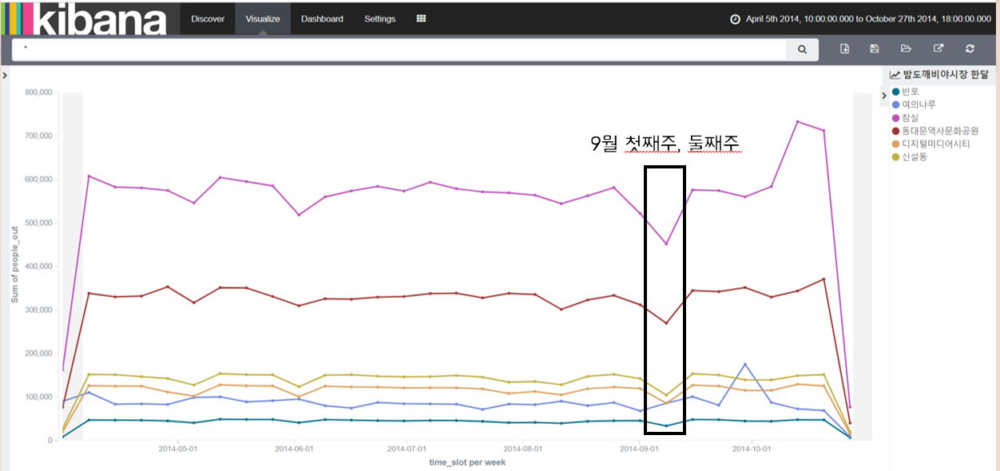

## 대용량 서울 지하철 데이터를 활용한 뚜벅이 여행지 추천

### Overview

> ELK Stack을 활용해서 서울 지하철 유동 인구수 데이터를 다운받은 후, 축제 기간에 사람들이 많이 몰리는 역을 선정하였다. 축제를 즐겨야 함에도 불구하고 사람들이 너무 많아 느낄 수 있는 불편함을 해소하기 위하여 두 가지 방법으로 여행지를 추천해준다. 첫 번째, 축제 운영 시기를 분석하여 가장 이동 인원이 적은 시기를 추천해준다. 두 번째, 축제 개최지 주변 역을 분석하여 지하철 하차 인원 수가 최저치인 역을 주 단위로 다르게 추천해주거나 축제 전체 기간 내에서 인구 이동이 적으면서도 축제를 즐길 수 있는 하나의 역을 추천해준다.


### Technology Used

#### ELK Stack

* ElasticSearch

  > JSON 기반의 분산형 오픈 소스 RESTful 검색 엔진

* Logstash

  > 여러 소스에서 동시에 데이터를 수집하여 변환한 후 ElasticSearch 같은 "stash"로 전송하는 서버 사이드 데이터 처리 파이프라인

* Kibana

  > 사용자가 ElasticSearch에서 차트와 그래프를 이용해 데이터를 시각화 할 수 있게 해준다. 

#### Analysis Process

> 밤도깨비 야시장 주별 여행지를 추천해주는 과정은 다음과 같다. 밤도깨비 야시장 개최지의 주변역을 조사하여 밤도깨비 야시장 기간 동안의 지하철역 하차 인원에 대한 통계를 내본 결과, 동대문역사문화공원역은 9/8에 가장 적은 숫자를 보이며, 디지털미디어시티역도 9/8에 최저 하차 인원수를 보였다. 다른 역도 이와 같은 과정을 통하여 역별 최저치의 하차 인원 수를 기록한 날짜를 모아 사람에 치이지 않고 밤도깨비 야시장을 즐길 수 있도록 최적의 시기를 추천해주었다. 



### Usage & Install

1. ElasticSearch 설치 및 실행 

   ```bash
   #ElasticSearch Download & Install
   $ wget https://download.elastic.co/elasticsearch/release/org/elasticsearch/distribution/tar/elasticsearch/2.4.1/elasticsearch-2.4.1.tar.gz
   #unpack
   $ tar xvf elasticsearch-2.4.1.tar.gz
   #run
   $ cd elasticsearch-2.4.1
   $ bin/elasticsearch
   ```

2. 데이터 용량이 많으므로 메모리 사이즈를 늘려 준다. 

   ```bash
   #elasticsearch.in.sh파일에서 ES_HEAP_SIZE 변경
   ES_HEAP_SIZE=512m
   ```

3. Plugin 설치

   ```bash
   #install plugin
   $cd  elasticsearch-2.4.1 
   $sudo bin/plugin   install   mobz/elasticsearch-head 
   # Set Config  
   $vi config/elasticsearch.yml   
   #node.name: node-1  
   #network.host: 0.0.0.0 
   $bin/elasticsearch  
    
   # Web 브라우저에서 접속  
   http:// Server_IP :9200/_plugin/head/ 
   * 사용 브라우저 : chrome, firefox ( IE 안됨 ) 
   ```

4. Kibana 설치

   ```bash
   # Download & unzip
   # https://www.elastic.co/downloads/past-releases/kibana-4-6-3
   $ cd ~
   $ wget https://download.elastic.co/kibana/kibana/kibana-4.6.3-linux-x86_64.tar.gz
   $ wget https://download.elastic.co/kibana/kibana/kibana-4.6.3-linux-x86_64.tar.gz.sha1.txt
   # Checksum
   $ sha1sum kibana-4.6.3-linux-x86_64.tar.gz > chkfile.txt
   $ more kibana-4.6.3-linux-x86_64.tar.gz.sha1 > chkfile.txt
   $ cat chkfile.txt
   5708f2c70087af81247080a3baf3a932c0cb3d98 kibana-4.6.3-linux-x86_64.tar.gz
   5708f2c70087af81247080a3baf3a932c0cb3d98 kibana-4.6.3-linux-x86_64.tar.gz
   Download
   $ tar xvf kibana-4.6.3-linux-x86_64.tar.gz
   $ cd kibana-4.6.3-linux-x86_64
   $ bin/kibana
   ```

5. Config 설정

   ```bash
   # Config
   $ vi config/kibana.yml
    server.host: “0.0.0.0”
    elasticsearch.url: “http://개별 서버 IP:9200” //Elasticsearch server Public IP 로 변경
   #Run
   $ bin/kibana
   # Visit URL : 브라우저 ( chrome, firefox )
   http:// 개별 서버 IP :5601 예) http://54.214.22:5601
   # process check
   $ ps –ef | grep kibana
   $ ps –ef | grep node
   # background run
   $ nohup bin/kibana & 
   ```

6. Kibana Plugin Sense설치

   ```bash
   $ ./bin/kibana plugin --install elastic/sense
   ```

7. 클러스터명 설정 및 Shard Allocation 설정

   ```bash
   $ cd elasticsearch-2.4.1
   $ vi config/elasticsearch.yml
   ```

   > elasticsearch.yml파일은 clustername, node.name, network.host 가 아래와 같이 설정되어야 한다.

   cluster.name: es-test

   node.name: node-1

   network.host: 0.0.0.0

   > Shard Allocation 명령문
   >
   ```bash
   curl -XPUT localhost:9200/_cluster/settings -d '{
       "transient" : {
           "cluster.routing.allocation.disk.threshold_enabled" : false
       }
   }'
   ```

8. ElasticSearch 실행

   ```bash
   $ bin/elastic &
   ```

9. Kibana 실행

   ```bash
   $ nohup bin/kibana &
   ```

10. Kibana Sense 접속

   ```bash
   https://개인 서버 IP 주소:5600/app/sense
   ```

11. seoul-metro-2014 인덱스 생성하기

    ```bash
    PUT seoul-metro-2014
    {
        "mappings" : {
          "seoul-metro" : {
            "properties" : {
              "time_slot" : { "type" : "date" },
              "line_num" : { "type" : "string", "index" : "not_analyzed" },
              "line_num_en" : { "type" : "string", "index" : "not_analyzed" },
              "station_name" : { "type" : "string", "index" : "not_analyzed" },
              "station_name_kr" : { "type" : "string", "index" : "not_analyzed" },
              "station_name_en" : { "type" : "string", "index" : "not_analyzed" },
              "station_name_chc" : { "type" : "string", "index" : "not_analyzed" },
              "station_name_ch" : { "type" : "string", "index" : "not_analyzed" },
              "station_name_jp" : { "type" : "string", "index" : "not_analyzed" },
              "station_geo" : { "type" : "geo_point" },
              "people_in" : { "type" : "integer" },
              "people_out" : { "type" : "integer" }
            }
          }
        }
      }
    ```

12. logstash 실행 시 메모리 부족으로 인한 에러가 발생할 가능성이 있기 때문에 리눅스 스왑을 이용한다.

    ```bash
    $ sudo -i : root 계정으로 변경
    #dd if=/dev/zero of=/root/swapfile bs=1024 count=2000000
    # chmod 600 /root/swapfile
    # mkswap /root/swapfile 
    # swapon /root/swapfile
    # free -m : 메모리 확인
    
    # 이후 swap파일을 끄고 싶다면
    # swapoff /root/swapfile
    ```

    

13. logstash 설치하기

    ```bash
    $ wget https://artifacts.elastic.co/downloads/logstash/logstash-6.5.1.tar.gz
    $ tar xvf logstash-6.5.1.tar.gz
    ```

14. Filebeat 설치하기

    ```bash
    $ wget https://artifacts.elastic.co/downloads/beats/filebeat/filebeat-6.5.1-linux-x86_64.tar.gz
    $ tar xvf filebeat-6.5.1-linux-x86_64.tar.gz
    ```

15. 서울 메트로 데이터 zip 파일 압축해제하기

    ```bash
    $ mkdir source #source 폴더 생성
    $ cd source #source 폴더로 이동
    $ wget http://54.214.227.60/elasticsearch/sample/seoul-metro-2014-source.zip #지하철 데이터 다운
    $ unzip seoul-metro-2014-source.zip #압축 해제
    ```

16. Filebeat과 Logstash설정

    ```bash
    $ cd logstash-6.5.1 #logstash 폴더로 이동
    $ touch logstash.conf #logstash config 파일 생성
    $ vi logstash.conf
    # vi파일 안에
    input {
      beats {
        codec => json
        port => 5044
      }
    }
     
    output{
     elasticsearch{
        hosts => ["127.0.0.1"]
        index => "seoul-metro-2014"
        document_type => "seoul-metro"
      }
    }
    
    ```

17. Filebeat 설정

    ```bash
    $ cd filebeat-6.5.1-linux-x86_64
    $ vi filebeat.yml
    #vi 폴더 안에
    enabled: true
    path: /home/ec2-user/source/data/*.log
    # elastic주석 처리하고 logstash 활성화를 위해 주석 해제
    
    $ pwd #pwd 명령어를 사용해서 이전에 압축을 해제한 지하철 데이터 소스의 폴더 위치를 찾아서 filebeat.yml에 입력해줘야 한다.
    ```

18. elasticserach, filebeat, logstash 실행

    ```bash
    $ bin/elasticsearch &
    $ bin/kibana &
    $ bin/logstash -f logstash.conf &
    $ ./filebeat -c filebeat.yml &
    ```


### Error

1. logstash 실행시 메모리가 부족하다.

   > 이 과정은 반드시 Elasticsearch에 데이터를 다운받기 전에 실행해야 한다. 처음부터 해주면 나중에 가서 고생을 하지 않는다.

   ```bash
   $ sudo -i : root 계정으로 변경
   #dd if=/dev/zero of=/root/swapfile bs=1024 count=2000000
   # chmod 600 /root/swapfile
   # mkswap /root/swapfile 
   # swapon /root/swapfile
   # free -m : 메모리 확인
   ```

2. log파일이 filebeat를 실행했음에도 불구하고 돌아가지 않는다.

   > filebeat.yml을 수정해준다.

   ```bash
   # Change to true to enable this input configuration.
   enabled: true
   ```

   